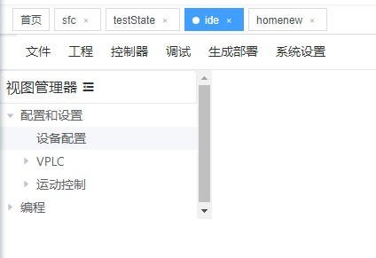
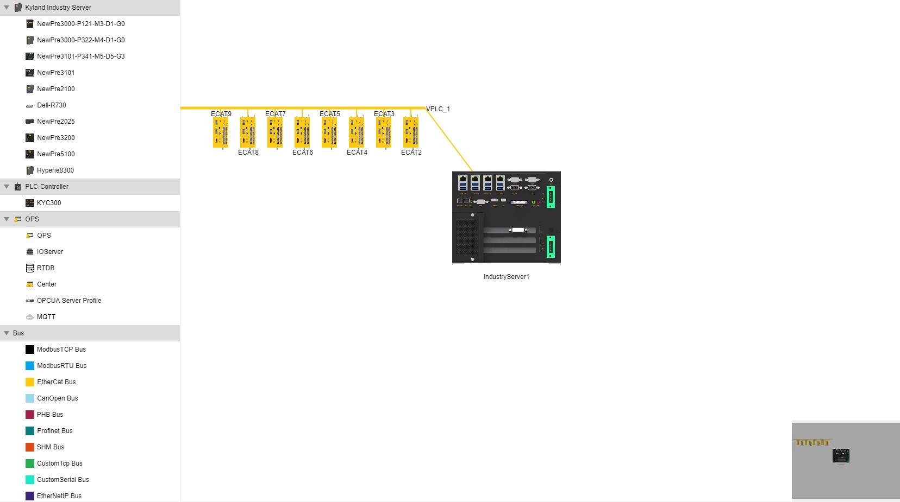

**5.27**

- [ ] 反向解析生成的xml文件生成对应的组件图
- [ ] 尝试触发vuex mutations和mxgraph之间的联系，要不然绘制到一半全部白画了~~~~

**6.5**

- [x] 关闭界面时，或者tagsView提交delView或者refreshView这些会影响到index.vue的action时，要添加onbeforeunload事件监听器
- [x] ~~上述事件发生时，要关掉当前界面用到的mxWindow和mxLog窗口~~

#### 事件

前：mxgraph自带的dispatch loop必须被所有的监听器继承，其内容如下：

##### mxgraph

```js
mxgraph是mxEventSource的子类，可以使用fireEvent方法
eventListener回调方法的格式是function(sender,evt)
分别表示事件的来源和事件本身
```

js数组删除下标为i的元素

```js
array.splice(i,1);
//如果从第i个位置删除多个，把1改成想要的个数即可，例如删除5个
array.splice(i,5);
```


```js
graph.addMouseListener(
{
  mouseDown: function(sender, evt)
  {
    mxLog.debug('mouseDown');
  },
  mouseMove: function(sender, evt)
  {
    mxLog.debug('mouseMove');
  },
  mouseUp: function(sender, evt)
  {
    mxLog.debug('mouseUp');
      //调用 
      你的方法（参数）
  },
   //上面是默认的，下面是自己添加的
  你的方法: function(参数){
//      方法内容
  }
});
```

##### mxEvent

使用场景：mxEvent给dom元素添加或删除方法

```js
mxEvent.addListener(dom,eventName,function)
//原生js写法，有一个div#app=>div1
div1.addListener('mousedown',funct(ev){
	//ev是点击事件，里面有点击事件的属性                 
})
//等价于
mxEvent.addListener(div1,mxEvent.MOUSE_DOWN,funct(ev){
	//处理
})
```

相关: mxgraph自带的dispatch loop和mxEventSource

```js
let click = graph.click
graph.click = function (me) {
    let event = me.getEvent();
    console.log(me.getGraphX());
    console.log(me.getGraphY());
    //上下的输出是相同的
    console.log(event.offsetX);
    console.log(event.offsetY);
    click.call(this, me)
    //graph中的事件处理顺序，1.addMouseListener 2.click 3.addListener？待验证，这个可能不适用于鼠标事件
}
```


##### mxEventSource

翻译过来就是事件源，它是很多组件的抽象类，组件其实就是事件的来源，可以看做是组件们的一个父类，一个更侧重事件处理方面的父类。已知的子类有mxGraphModel,mxGraph,mxGraphView,mxEditor,mxCellOverlay,mxToolBar,mxWindow

这些组件都比较大、常用作放置其他小组件，把它们提取成事件源主要是因为使用比较频繁，涉及事件处理的场景比较多。

##### mxMouseEvent

###### DOM原生继承关系

Event<------UIEvent<------MouseEvent<------PointerEvent

mxMouseEvent中的evt就是PointerEvent

##### mxEventObject

这个是事件对象中包裹的事件实体对象，里面存了事件的名称，对应的回调方法和绑定的mxEvent.XXXX,还可以携带键值对参数

```js
let a = new mxEventObject(mxEvent.CLICK,'event',evt,'cell',cell)
```

#### 处理器handler

连接处理 mxConnectionHandler


#### 工具类

#### 方法重载

示例中的方法重载都是使用apply(this,arguments)的形式，这样会导致重载失败，应该使用call(this,你修改之后的参数依次排列)

```js
//先将方法赋值给一个变量，否则出现maximum call stack exceeded
var cellLabelChanged = graph.cellLabelChanged
graph.cellLabelChanged = function(cell, newValue, autoSize){
    if (mxUtils.isNode(cell.value)){
        // Clones the value for correct undo/redo
        var elt = cell.value.cloneNode(true);
        elt.setAttribute('name', newValue);
        newValue = elt;
        autoSize = false
      }
    cellLabelChanged.call(this,cell,newValue,autoSize)
    //这里如果使用cellLabelChanged.call(this,arguments)的话，会导致newValue等参数还是方法传入的值，并不是修改后的值
};
```

====

```text
createHandlers	Creates the tooltip-, panning-, connection- and graph-handler (in this order).
createTooltipHandler	Creates and returns a new mxTooltipHandler to be used in this graph.
createSelectionCellsHandler	Creates and returns a new mxTooltipHandler to be used in this graph.
createConnectionHandler	Creates and returns a new mxConnectionHandler to be used in this graph.
createGraphHandler	Creates and returns a new mxGraphHandler to be used in this graph.
createPanningHandler	Creates and returns a new mxPanningHandler to be used in this graph.
createPopupMenuHandler	Creates and returns a new mxPopupMenuHandler to be used in this graph.
createSelectionModel	Creates a new mxGraphSelectionModel to be used in this graph.
createStylesheet	Creates a new mxGraphSelectionModel to be used in this graph.
createGraphView	Creates a new mxGraphView to be used in this graph.
createCellRenderer	Creates a new mxCellRenderer to be used in this graph.
createCellEditor	Creates a new mxCellEditor to be used in this graph.
```

- [x] 用户关闭界面的时候会触发onbeforeunload，之后将graph中现有的内容进行持久化，如果session没有重置，那么下次加载时就重新加载上次暂时保存的数据，否则重置graph
- [ ] 后续的需求……

#### bind : function(scope,funct)

```js
相当于把funct方法体中的this都换成scope
```

### mxGraph

stopEditing(boolean)

```js
let graph = new mxGraph(container)
graph.stopEditing(false)
//false表示正在编辑的内容要保存，true表示正在编辑的内容不会保存，直接没了
```

setResizeContainer(boolean)

```js
graph.setResizeContainer(true);
//resize the container with bottom and right border
graph.minimumContainerSize = new mxRectangle(0,0,300,500)
//config the minimum size of container
```


### mxPopupMenuHandler

在创建mxPopupMenuHandler时会使用到factoryMethod

```js
new mxPopupMenuHandler(graph,function(){
    
})
//function的位置可以换成自定义的方法，该方法接收3个参数，分别是mxPopupMenuHandler，cell,event	
```


```js
//在mxgraph中一次完整的点击事件是mouseDown---mouseUp---click
//所以事件监听器的调用顺序也是按照上述
//mouseDown的起始点必须在监听器对象中，而mouseUp不用
//所以在其他地方按下鼠标，移动到画布上或者其他组件上，不会触发mouseUp或者click
//但是在画布或者其他组件上按下鼠标，在外面松开，三个事件仍旧会被依次触发
```

- [ ] ~~用户从数据库中读一条记录最终映射成前端的一个mxgraph组件~~
- [x] 上述反向，即组件保存mysql（已经实现）

- [x] 删除组件时要分发action
- [x] 新增组件时要分发action
- [x] 上述两个action都是向徐贞琛的ide中添加子条目，最终的效果是：拖拽一个组件后，左侧的树状结构（设备配置）中出现对应的条目



- [ ] 向贞琛的ide.vue中添加子路由

### svg & canvas

### 数据库加载组件

mounted钩子中无法获取到el-tree的class或者ref，因为el-tree延迟渲染


