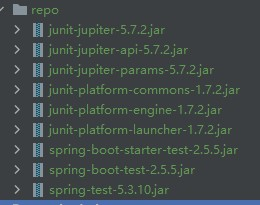

## Advanced Java

### JVM

**jvm结构**

类加载器(ClassLoader):①把java代码转换成字节码

运行时数据区(Runtime Data Area):②把字节码加载到内存中，~~命令解析器执行引擎~~将字节码翻译成机器码，该过程需要调用*本地库接口*

执行引擎(Execution Engine):上面的删除线

本地库接口(Native Interface):上面的斜体

#### 运行时数据区


### 线程和线程池

##### create threads

①inherit the ***Thread*** class, and rewrite the *run* method of theThread class

calling run() is equivalent to calling a method in a class and does not create a new thread,but calling start() creates a brand new thread.

*as code list shown below*

```java
//============MyThread.java==============
package advanced.java.threads;

public class MyThread extends Thread{
    public MyThread(String name) {
        super(name);
    }

    @Override
    public void run() {
        System.out.println(Thread.currentThread().getName()+"11oo");
    }
}
//===========TestThread.java============
package advanced.java.threads;

public class TestThread {
    public static void main(String[] args) throws InterruptedException {
        MyThread myThread = new MyThread("gzq");
        myThread.start();
        myThread.join();//gzq11oo
        //myThread.run();//main11oo
    }
}
```

②implement the *run* method of the interface ***Runnable***


③Use a thread pool mode :***callable*** interface

### 锁

### 垃圾回收机制

### 中间件

#### memcached

和redis目的一样，通过缓存数据库查询结果，降低访问数据库的次数，提高动态web应用的速度，提高其可拓展性

key-value


第一次：RDBMS读取到memcached并同时显示（蓝色）

第二次：直接从memcached读（绿色）


## Tomcat

**不使用SpringMVC的DispatcherServlet怎样将Spring的ApplicationContext加载到Tomcat'容器'中？**

Spring-web包中提供了ContextLoaderListener这个监听器，自定义一个继承ContextLoaderListener的子类，在contextInitialized方法中把ApplicationContext进行保存，例如保存成静态属性。

```java
public class GlobalListener extends ContextLoaderListener{

    private static ApplicationContext ioc;

    @Override
    public void contextInitialized(ServletContextEvent sce) {
        //after the initiation,there should be an spring application context in the tomcat
        ApplicationContext context =
                WebApplicationContextUtils.getWebApplicationContext(sce.getServletContext());
        ioc = context;
    }
}
```


## Spring

四大核心依赖：***beans core context expression***


### 我碰到的异常

***nested exception is java.lang.IllegalStateException: Ambiguous mapping. Cannot map 'disposeMoldPartController' method***

```java
MappingJackson2HttpMessageConverterConfiguration默认集成到了Spring中，所以SpringBoot能把普通java对象转换成JSON数据
```

pom.xml逐行解析，中途出错会导致后续的maven依赖注入失败，

**报红的maven依赖一定要写在最末尾**


*springboot2.x complicated with junit5*

```java
@SuppressWarnings
```

常见的值有：

deprecation:忽略不赞成的警告

```java
//no serializer found for class一般是因为一个类转JSON时没有get set方法导致的，序列化相关
```

### junit

junit5的引擎叫Jupiter,junit4的叫vintage，使用对应的，其余的要在maven中exclude掉  

需要的jar包有




### vue-cli指令

npm install -g vue-cli安装脚手架，成功之后继续

vue init webpack 项目名称

之后的配置中要选择eslint和run npm install 以及 vue-router

测试相关的可以不选

之后就可以运行dev script启动项目

### 数组

数组分为condensed array 和literal array

### Vue

vue如果遇到v-model不同步更新的话，说明该对象没有该属性，例如input中的值只是在出发onchange和onblur之后才会更新，需要使用this.$set(object,'field you want','value of the field');

setInterval(function,timeout);

setTimeout(function,timeout);

```javascript
//查询结果存到一个数组里,
[
key:aa,
deptName:bb,    
subTree:[
 {
    key:xx,
    deptName:xxx,
    subTree:[
 	{
 
 }
]
 },
 {
     key:yy,
     deptName:yyy,
	 subTree:[
     	//......
     ]         
 }
]]
```

ERP=enterprise resource planning

CRM=customers relationship management

PDM=product data management


```java
@Autowired
private StudentService service;
/**
* 上述方法是选择依赖注入
* 在使用到StudentService的时候才会进行注入，容易出现
* 空指针异常
*/

/**
* idea推荐使用构造器的方法进行注入
* 在初始化时就进行依赖注入，这样在检查代码时就会进行依赖
* 的校验，为空时就会出现空指针异常，不会在运行时才报错
*/
final StudentService service;

public StudentController(StudentService service){
    this.service = service;
}
```

使用maven导入第三方jar包时，本身就需要junit这个包，所以在导入其他版本的junit之前，不能删除maven/repository下的Junit


mybatis 语句经常在 insert 中调用序列，或者类似序列等自动生成某个字段的selectKey，如果当前insert语句中有参数的话，这个selectKey会调用参数中的set方法，之后调用get方法，如果写作

```java
@Param("tom")
//那么在xml文件中读取时应该使用tom
```

```java
String.format("%04d",i);
//这段代码表示将i变成长度为4的字符串，不够4位前面补零
```

1007336714
1007336683


### activiti

*historyService查询到的task有是否finished()即是否完成之分。*因为未完成的task也会入ACT_HI_ACTINST表，查询时要注意。

```java
historyService.createHistoricTaskInstanceQuery().finished().....list();
```

查询历史记录时，activiti提供了listpage(index,limit)方法，用来限制条目数量


## spring事务传播机制 propagation

### 分类

| 分类                                                         |
| ------------------------------------------------------------ |
| required(Spring默认)                                         |
| requires_new(开启新事务，被调用的方法异常会冒泡到调用的方法，父不影响子) |
| never(有事务会报错)                                          |
| supports(没事务就依照没事务的情形执行)                       |
| mandatory(没有事务会报错)                                    |
| not_supported(有事务直接忽视)                                |
| nested(类比required_new 调用会影响被调用)父子整体            |

## SSM

#### SpringMVC

流程实现 dispatchServlet

#### SpringAOP

AOP的实现


## mysql

### 数据结构

##### 索引

InnoDB的数据结构是**B树和B+树**

###### B树


### 隔离级别

8.x之前的版本使用@@tx_isolation

8.x及8.x之后使用transaction_isolation,@@tx_isolation会报错找不到


set session transaction isolation level + following 4 choices

```sql
read committed
read uncommitted
repeatable read
serializable
```

default repeatable-read, which can run without the risk of dirty read and non-repeatable read  or lost read,but can not solve phantom read


```java
/**
 * don't use more than 5 **join**
 * take temporary tables into acount
 * fewer sub-retrieval
 * view nests should be no more than 2 layers
 */
```

execution orders


### 前后端数据格式之间的对应关系

| 前端                  | 后端接收方式                                                 |
| --------------------- | ------------------------------------------------------------ |
| Request PayLoad       | 整个request之后进行解析,                                     |
| 普通键值对，form data | 无需注解，POJO只要有对应属性的set方法即可赋值,或者通过@RequestParam进行映射 |
| 只传数组              | @RequestBody List<T>即可                                     |

***注意事项*** 通过api中的request发请求携带的参数一般是request payload(POST) ,而其他一般是form data例如this.download等方法

先者需要通过键值对进行POJO封装和@RequestBody进行结合使用，后者直接@RequestParam

##### TIP1

如果封装的属性或者参数个数很少，或者项目中的视图类viewObject太多，可以在前端进行手动封装

```javascript
//数组对象People=[person1,person2,person3]
//字符串remark="用户操作000"

var obj = new FormData();
obj.append("people",JSON.stringify(People));
obj.append("remark",remark);

axios({
    method:'post',
    data:obj,
    ……
})
```

```java
import com.byd.gzq.Person;

@PostMapping("/上面请求的url")
public String personOperation(@RequestParam("people") String people,@RequestParam("remark") String remark){
    List<Person> personList = JSON.parseArray(people,Person.class);
    ……
}
```


InternalResourceViewResolver视图解析器继承了UrlBasedViewResolver，两个属性叫做prefix和suffix

如果不指定springmvc配置文件的位置，默认去找前端控制器名-servlet.xml


Tomcat服务器有一个大的web.xml配置文件，所有项目的web.xml文件都是继承自这个大的web.xml

在大的web.xml中，url-pattern始终是/，即不拦截*.jsp请求

```xml
<servlet>
  <servlet-name>default</servlet-name>
  <servlet-class>org.apache.catalina.servlets.DefaultServlet</servlet-class>
    <init-param>
      <param-name>debug</param-name>
      <param-value>0</param-value>
    </init-param>
    <init-param>
      <param-name>listings</param-name>
      <param-value>false</param-value>
    </init-param>
  <load-on-startup>1</load-on-startup>
</servlet>

<servlet-mapping>
   <servlet-name>default</servlet-name>
   <url-pattern>/</url-pattern>
</servlet-mapping>
<!--摘自Tomcat conf/web.xml-->
```

oracle进行模糊查询时，若包含通配符，使用instr会提高效率，而弃用like '%xxx%'

枚举类会在初始化时按照成员的声明顺序依次调用构造方法，不管实际引用了或者使用了哪些成员

```java
public enum Color {
    RED{
        @Override
        public String getInfo(){
            return "red";
        }
    },BLUE{
        @Override
        public String getInfo() {
            return "blue";
        }
    },BLACK{
        @Override
        public String getInfo() {
            return "black";
        }
    };
    private Color(){
        System.out.println(this.name());
    }

    public abstract String getInfo();
}
//================================
public class EnumApplication {
    public static void main(String[] args) {
        Color a = Color.BLACK;
        System.out.println(a.getInfo());
    }
}
//上述代码的结果将是
RED
BLUE
BLACK
black
//可以利用这种机制进行输出每个元素，《数据结构》
在Dictionary中就有返回元素枚举值的方法,elements
```

比较时把数字写在前面可以避免NullPointerException

```java
if (1 == masPdmApiMapper.addProjectData(pdmProjectTmp)) {
    lStoreProjectId = pdmProjectTmp.getId();
}
```

#### 数据恢复

```sql
#使用该sql查询对某个表的
SELECT r.first_load_time,r.* FROM v$sqlarea r ORDER BY r.FIRST_LOAD_TIME DESC;
	SELECT * FROM D_S_MATERIEL AS OF timestamp to_timestamp('2022-03-05 09:21:38','yyyy-mm-dd hh24:mi:ss');
ALTER TABLE D_S_MATERIEL enable ROW movement;
flashback TABLE D_S_MATERIEL TO timestamp to_timestamp('2022-03-05 09:21:38','yyyy-mm-dd hh24:mi:ss');
```

### suggested commit message

```markdown
<type>(scope):_description(there's a blank space between the colon and description)

feat(mapper): description
fix(scope): description
refactor(scope): description
docs:only
perf
revert
```

## 日志框架

### Log4j

log4j有三个主要的组件：

loggers记录器，appenders输出源，layouts布局

#### loggers

#### appenders

常用的Appender：

```java
org.apache.log4j.ConsoleAppender;
org.apache.log4j.FileAppender;
org.apache.log4j.DailyRollingFileAppender;
org.apache.log4j.RollingFileAppender;
org.apache.log4j.WriterAppender;
```

在properties格式的配置文件中应该写成：

```properties
log4j.appender.[appenderName] = [上面的全类名]
log4j.appender.[appenderName].属性1 = []
#带有[]的表示该处要用户自己替换
```

配置文件第一句：

```properties
log4j.rootLogger = [level],appenderName1,appenderName2,appenderName3......
#备选level就是info,warn,debug,error,fatal,off,all这些   优先级顺序debug<info<warn<error<fatal
```

着重：PatternLayout.ConversionPattern的备选项

```properties
# %p:priority debug warn这些优先级，
# %t:name of thread
# %r:从程序启动到输出日志所花费的毫秒数
# %c:日志源名 ----loggername
# %C:qualified class name  
# %M:method name of the logger   ----main或者myfunction....
# %F:filename
# %L:line number
# %l:相当于%C.%M(%F:%L)  输出类似 com.byd.gzq.TestClass.main(TestClass.java:22)这种的，全类名加方法名加文件名加行号 全称location,日志发生的位置，匿名类可能是类似com.xxxx.Student$1.methodName这样的
# %m:message
# %n:\n
# 所有的%和标识符之间可以加上限制位数，例如%5p标识优先级占五位
# 注意几对大小写字符的存在,l和L，c和C 
```


## morse code

A 13

B 3111

C 3131

D 311

E 1

## Shell

```shell
#0
#0.1 文件开始最好注明下面任意一种
#!/bin/bash 
#!/bin/sh
#1 变量中除了下划线不能出现别的标点符号
#2 首字符不是数字
#3 声明变量时不用$符号，必须紧挨=
#4 使用变量时${变量名},大括号可省，拼串时定义边界
#5 重复声明不带$
name="helloworld"
echo $name
name="new helloworld"
echo $name

#6 只读变量
r_name="readonly"
readonly r_name
r_name="change readonly"
#输出 r_name:This variable is read only

#7 删除变量unset 对只读变量无效
name="init"
echo $name #init
unset name
echo $name #空

#8 单双引号的区别
##8.1 单引号中的变量无效，所有内容原样输出，转义符没用，单个单引号不能识别，成对出现可以拼串
name='hello''world'++
##8.1 字符串定义时可以不用使用任何引号，上述例子输出 helloworld++

#9 字符串操作
##9.1 长度
name="helloworld"
echo ${#name} #10

##9.2 子串
name="helloworld"
echo #{name:0:3} #hel 从0开始取3个（包括第0个，基标始于0）

##9.3 查下标
name="helloworld"
echo `expr index "$name" io` #i和o谁先出现就返回谁的下标，这里是5，真实位置，下标+1

#10 数组
arr=(char 43 ji)
${arr[0]} #char
$arr #char 不写下标就是第一个
${arr[@]} # char 43 ji 索引位置标@取所有元素

${#arr[0]} #4 想获取某个元素的长度就和之前的获取变量长度一样，先取元素，再操作
${#arr[@]} ${#arr[*]} #3 获取数组的元素个数，使用@或者*

#11 多行注释
:<<EOF
内容。。。
<必须空一行>
EOF

#12 传参
[root@localhost ~]# ./shell.sh a1 a2 a3
#shell.sh的内容
#!/bin/bash
echo $0
echo $1
echo $2
echo $3
#输出 ./shell.sh ##注意$0是命令本身./shell.sh
#a1
#a2
#a3

##12.1 循环
for i in "$@";do  #把参数分开，整体作为数组1 2 3输出1\n2\n3\n
  echo $i
done
for i in "$*";do #把参数作为一个整体，"1 2 3"
  echo $i
done

#13 shell运算
##13.1 shell不支持原生的运算，但是可以通过expr来实现
echo `expr 1 + 3`  #4 注意使用反引号`，运算操作数和操作符不能紧挨，1+3无效，1 + 3正确

##13.2 判断
if[$a == $b]
then
  echo $a
fi

##13.3 ``中的内容要执行一次，若存在错误则无法正确返回 乘法运算符*必须转义\*
```

| -eq  | -nq  | -gt  | -lt  | -ge  | -le  | -o     | -a   | !    |
| ---- | ---- | ---- | ---- | ---- | ---- | ------ | ---- | ---- |
| ==   | !=   | >    | <    | >=   | <=   | \|\|或 | &&与 | !非  |

```shell
#(续)
#14 
```


## Redis

### redis应该提供基础数据而不是校验结果

例如：把smembers的结果交给程序，而不是sismember的判断结果

**redis set应用场景①**使用set统计网站UV和


# C/C++

## 前期配置

gcc版本 Red Hat 4.8.5-4) 

## 基本注意点

```shell
"sizeof" on array function parameter will return size of the pointer
```


### 构造函数

### 析构函数

### 结构体

### 联合体

## 指针

### 基本使用

### 高级使用

## 数据结构

### C实现二叉树

### C实现链表

### 搜索算法

### 排序算法

## C++ STL

# JavaScript

## 模块

只要把不同的函数和记录状态的变量放在一起，就算是一个模块，实现特定功能的一组方法。

### CommonJS

```js
/*there's a file named math.js*/

var math = require('math')
math.funcA(args)
```

commonJS存在的问题：funcA的执行必须等待math.js加载完成，对于服务器端来说，所有模块都在硬盘里，等待时间就是读取硬盘时间，但是在浏览器中情况不同，等待时间取决于网速，此时，AMD诞生了

### AMD(asynchronous module definition)异步模块定义

模块的加载不影响它后面语句的执行,使用回调函数的形式

```js
define(id?,dependencies?:array,factory)
```

**使用原型方法和在构造方法中使用this.xxx有什么区别:**

使用原型定义方法更容易修改，实例化之后也仍然可以通过类名.prototype进行修改，而使用构造方法中的this.xxx定义之后，只能通过对象名依次修改方法体；此外prototype更快更省空间，不会出现每个对象复制一份方法的情况

### js String对象

replace(/[]/g,'') 正则修饰符，i表示忽视大小写，g表示匹配全局而不是匹配到一个就停下，m表示匹配多行


